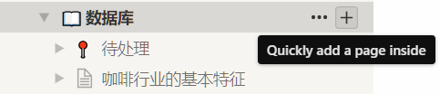

# Notion

## Notion 的底层逻辑

### 简介

Notion 具有无限的层级和相互链接的组织弹性，给笔记间的关系提供了足够自由的组织方式。

它排版灵活，能够把笔记里的内容按块（Block）进行组织和拖拽，甚至可以做出 Trello 看板进行项目管理；它的内容类型丰富，可以嵌入图片、网页、文档甚至视频。

一个 Notion 的界面主要分为可隐藏的左侧边栏和右侧的笔记界面。一个页面又可以由 Block 构成。

### Block

Notion 的笔记内容是由不同类型的 Block 组成。文字、列表、图片就是几种 Block。**Block 是 Notion 中最基本的单位，它实际上就是一块可以拖拽的内容，而这个内容有很多种类型**，不同类型的 Block 有不同的功能和表现形式。

每一个 Block 都是可以拖拽的，也可以框选多个 Block 以后一起拖。还可以将当前 Page 下的 Block 拖拽到目录里的任意 Page 中，或者把目录中的某个 Page 拖到当前 Page 中成为一个子 Page。Notion 的随意拖拽和栅格排列可以让我们以极低的操作成本布局甚至重组笔记。

如何添加一个 Block 呢？新建一行，输入`/`会弹出 Block 类型列表供搜索和选择。

### Page

在 Notion 中，笔记被称为「Page」。Notion 中的 Page 很灵活，可以在 Page 中的**任意位置**（如某个列表的条目下）添加子 Page，子 Page 中还可再添加 Page，可以**无限层级**地添加下去，所以 Page 其实也是文件夹。

Notion 中没有「文件夹」或「笔记本」的概念，**Page 既扮演了笔记的角色，又扮演了文件夹的角色**。

### Comment

用户可以在 Page 的任意位置、为任何 Block 发表评论，是团队沟通利器。在 Comment 中你可以评价他人工作，提出建议等。在处理完 Comment 后，点击 resolve 该 Comment 会转变为 resolve discussions。

### 「日程」、「任务 & 讨论」是什么？和「数据库」有什么区别？

我们会发现，「BpCoffee Team Home」中 Page 有好几种形式，在「数据库」和其子页面，看上去和 Markdown 文本差别不大，但是「日程」、「任务 & 讨论」一个长得很像表格，另一个长得又像看板，他们之间的底层逻辑是什么？

同时，从侧边栏可以开到，「日程」、「任务 & 讨论」、「数据库」都有子页面，这些子页面又是什么？

简单来说， [日程](https://www.notion.so/bpcoffee/64a324bec5394c128df50e0495ae630d?v=3343fb6b4dd94cb5816296f2e35caae2)  、  [任务 & 讨论](https://www.notion.so/bpcoffee/255167b47fd44cc1a438ae1148df7318?v=fbbcad04009b476dbff5e3bc220b3e11) 的子页面是同一个表格的不同视图。对比 [日程 - Show All](https://www.notion.so/bpcoffee/64a324bec5394c128df50e0495ae630d?v=3343fb6b4dd94cb5816296f2e35caae2) 与 [任务 & 讨论 - Table - Show All](https://www.notion.so/bpcoffee/255167b47fd44cc1a438ae1148df7318?v=003a1f1c9c944b7b8be6985de62668fd) 这两个页面，不难发现发现两者都是表格，由很多 Page  构成。而表格视图中的每一个列表都代表了 Page 不同的维度，例如 Assignee，Created Date，Status 等等。

[任务 & 讨论 - Board by Status](https://www.notion.so/bpcoffee/255167b47fd44cc1a438ae1148df7318?v=45e2ce1bcc5d43dc94e80633cdca4976) 这个视图就是表格的看板视图，它把不同的 Page 根据 Statue 进行分类，从 No Status 到 Archive 。只要简单的对 Page 拖拽，就可以改变 Page 的 Status 维度。同样，其他不同的视图都有独特的效果，例如 [Board by Assignee to Me](https://www.notion.so/bpcoffee/255167b47fd44cc1a438ae1148df7318?v=37e95e01152140f48e965f2222f06f86) 视图只会显示自己参加的任务或者讨论，[Calendar](https://www.notion.so/bpcoffee/255167b47fd44cc1a438ae1148df7318?v=36b7131032fd483a9a71f6d78bec2634) 视图会以日历的形式显示任务。

而数据库的子页面是 Page ，不是视图。他们之间只有层级关系。区分层级与视图是理解 Notion 重要的一点。

### 内部链接是什么？

在 Notion 中，任何 Block 或者 Page 都可以复制它的链接，这种弹性的组织关系可以让 Notion 形成交叉的网络拓扑。

同样，复制的内部链接可以作为**绝对坐标**使用，极大的降低沟通成本。

## BpCoffee Team Home 运作介绍

- [BpCoffee Team Home](https://www.notion.so/bpcoffee/BpCoffee-Team-Home-3a9b0724ec75462688c1e7e66045f644)
  - 本页为团队首页，存放 Notion 的内部链接，Github 外部链接
- [日程](https://www.notion.so/bpcoffee/64a324bec5394c128df50e0495ae630d?v=3343fb6b4dd94cb5816296f2e35caae2)
  - 日程存放团队时间节点，如每日例会，Deadline 等
  - 公示重要日程 & 团队 Deadline
  - Tip：可把 任务 & 讨论 中的 Page 的内部链接添加在 page content 中
- [任务 & 讨论](https://www.notion.so/bpcoffee/255167b47fd44cc1a438ae1148df7318?v=45e2ce1bcc5d43dc94e80633cdca4976)
  - 作用：公示自己正在做的任务、给别人分配任务，或**发起一个讨论**
  - 维度简介：
    - Assignee：参与人
    - Created By：创建者
    - Created Date：创建日期
    - Optional Due Date：截止日期
    - Status：Block 状态，下文有详解
    - Tag：标签
  - 可以在任务下面附上参考链接与思路
  - 以最常用的视图 [Board by Status](https://www.notion.so/bpcoffee/255167b47fd44cc1a438ae1148df7318?v=45e2ce1bcc5d43dc94e80633cdca4976) 为例：
    - No Status：任务 Inbox 放置所有等待中的任务
      - In Progress：大多数时候，在将任务拖动到 In Progress 时，就需要为任务指定人员
      - Completed：
      - Q&A：等待检验与答疑
      - Archive：任务归档
  - [Board - Assignee](https://www.notion.so/bpcoffee/255167b47fd44cc1a438ae1148df7318?v=fbbcad04009b476dbff5e3bc220b3e11)
    - 这个视图则是从参与人的角度分类
    - 清晰的显示每个人任务量
- [数据库](https://www.notion.so/bpcoffee/b2af9d95d6084563b6220b4ccb99ec59)
  - 团队的数据库
  - 可简单理解为——自带层级的 Markdown 文件库

## Notion 实例

### 如何优雅的更新团队数据库？

- 没有明确分类的数据，存入 [待处理](https://www.notion.so/bpcoffee/6cfaa493478d4128b7073f9fab22d175)
- 如果清晰的层级关系
  - 
  - 
  - 更新数据

### 如何优雅的追上队友进展？

- 点击侧边栏中 All update 可以获得三天内所有页面的修改记录
- 右上角 update 可以获得该页面的修改记录

### 如何优雅的更新会议记录？

1. 基于 [模板](https://github.com/lvxuan149/IA002BpCoffee/wiki/HbMeetingTemplate) 总结会议
2. 在 [日程](https://www.notion.so/bpcoffee/64a324bec5394c128df50e0495ae630d?v=3343fb6b4dd94cb5816296f2e35caae2) 中找到会议对应 Page ，打开后在最下方更新信息

### 如何优雅的公示任务 or 找协作？

1. 打开 [任务 & 讨论](https://www.notion.so/bpcoffee/255167b47fd44cc1a438ae1148df7318?v=45e2ce1bcc5d43dc94e80633cdca4976)
2. 
3. 
4. 
5. 发布到微信群
6. 及时在对应 Page 中更新信息，把相关链接，思考过程补充在最下方（在任务信息中点击 Edit Page Content，之后就可以随意书写了）
7. 善用 Add a comment

### 如何优雅的开展主题讨论？

1. 同上，在 [任务 & 讨论](https://www.notion.so/bpcoffee/255167b47fd44cc1a438ae1148df7318?v=45e2ce1bcc5d43dc94e80633cdca4976) 中新建 Page
2. 复制 Page 内部链接并发布到微信群
3. 利用 Add a comment 集思广益
4. Page 最下方（点击 Edit Page Content）沉淀信息

### 如何优雅的搜索？

- 方法一：点击侧边栏中的 Quick Find
- 方法二：键盘快捷键 Ctrl+P 唤醒 Quick Find
- Quick Find 不仅可以全文检索，还可以方便我们在各个 Page 中跳转

### 如何优雅的提意见？

- 方法一：是直接对内容进行修改，并 @相关人员
- 方法二：对 Block 或 Page 添加 Comment

## Notion 进阶理解资料

[Notion：重新定义数字笔记](https://sspai.com/post/39694)
[键盘快捷键](https://www.notion.so/bpcoffee/Keyboard-and-Markdown-Shortcuts-66e28cec810548c3a4061513126766b0)
[Notion 官方 Task & Issue 使用指南](https://www.notion.so/bpcoffee/Tasks-Issues-bbb80617e6af40c6a1b4f9ea8ed9612d)
[Notion 官方团队协作介绍](https://www.notion.so/bpcoffee/Organisation-of-the-team-Notion-f97a513dcada4ddab49920b00ee73d44)
[我的数字 2017：Notion、笔记和其他](https://sspai.com/post/43026)

## tips

### 分享

你可以为 Page 设置权限: 「私有」、「只读」、「读写」。只读（Read Only）和读写（Full Access）状态下别人可以通过你分享的链接访问到笔记。读写状态下，别人必须登录 Notion 才能编辑，对未登录的路人依然是只读的。

要给别人分享自己的笔记，设置为只读或读写的权限后，**直接发一个链接给对方即可**。

### 在 Page 内链接另一个 Page

可以在 Page 内添加另一个 Page 的链接（而不需要把另一个 Page 复制过来）。这种弹性的组织关系让 Page 之前不仅是严格的上下级关系，还可以是**交叉的网络拓扑**。

### 导入

可以将 Google Docs、印象笔记、HTML 等导入，自动生成笔记。

### 导出

目前可以导出为 PDF 和 Markdown。

### 历史版本

谁都会有手滑的时候。Notion 会为免费用户的每一条 Page 保存 3 天的版本记录。我曾经就手滑不小心删除了一些重要信息，这一功能挽回了我一整天的工作量。
